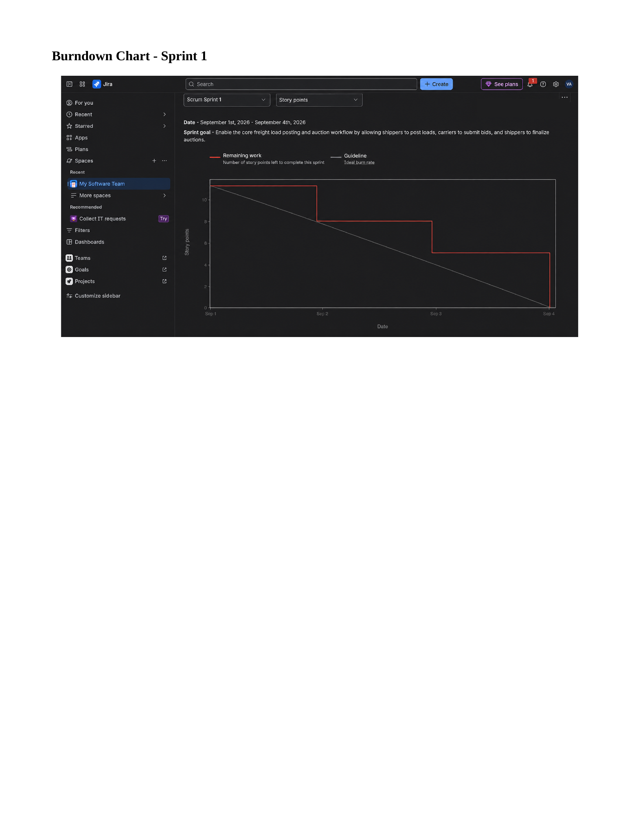
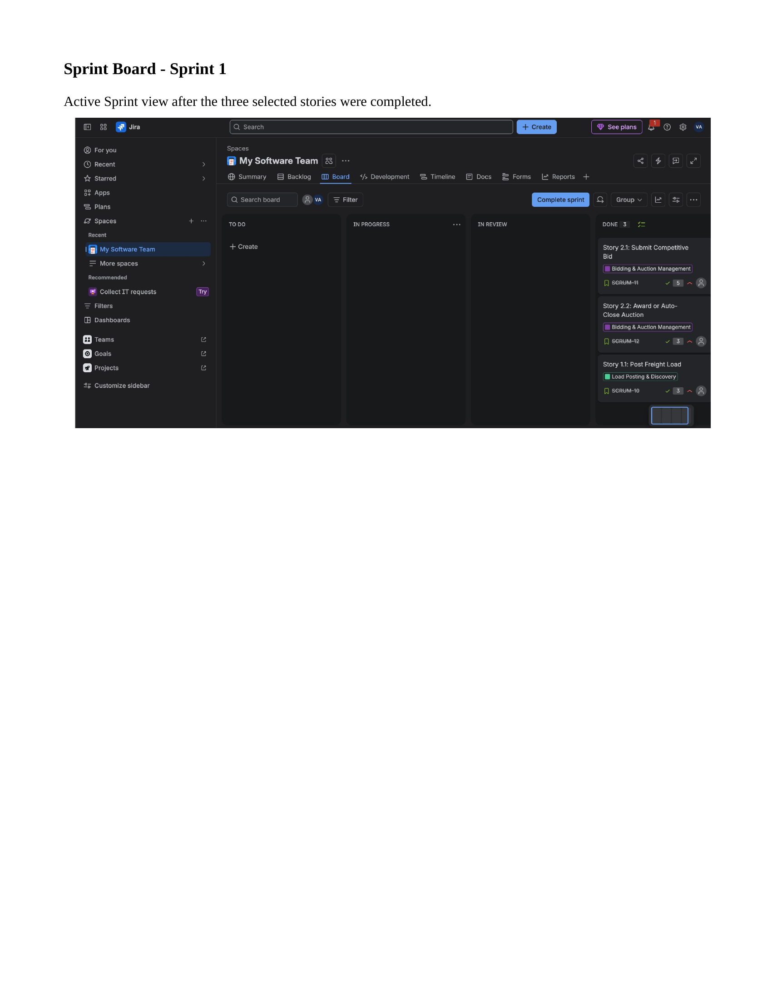
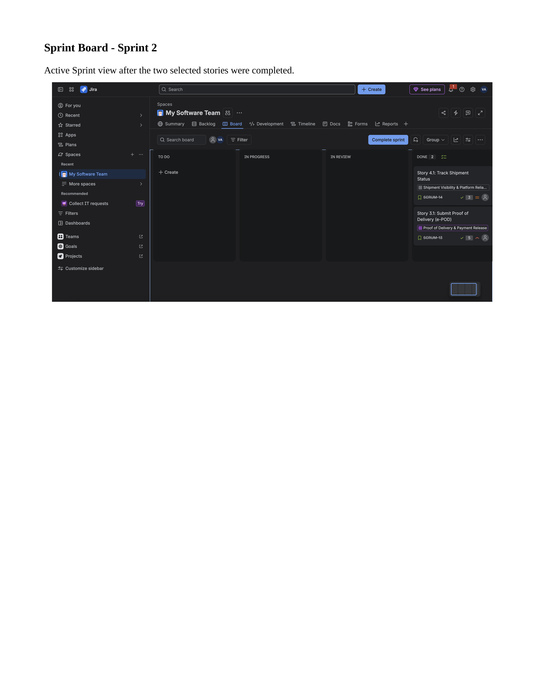
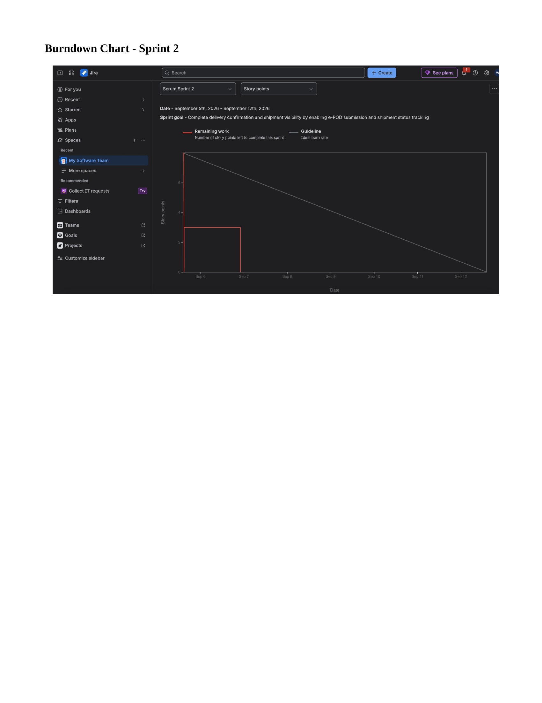
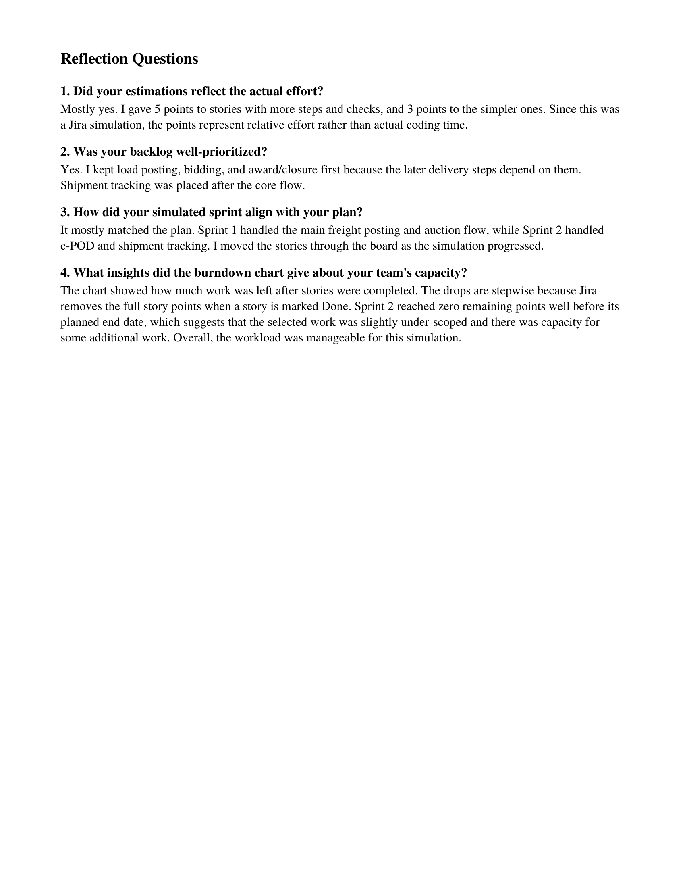
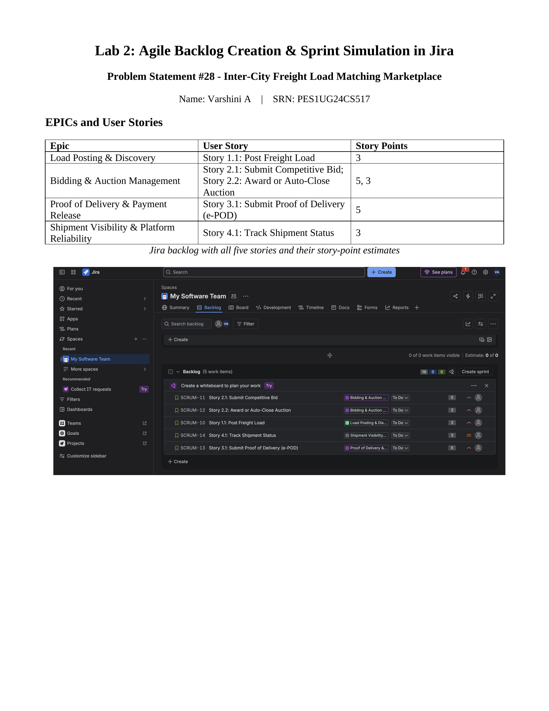
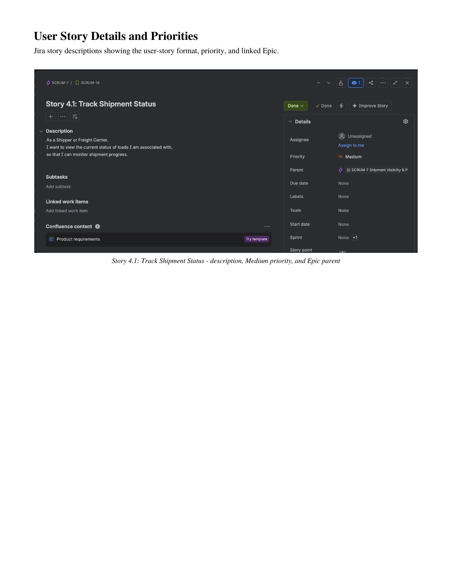
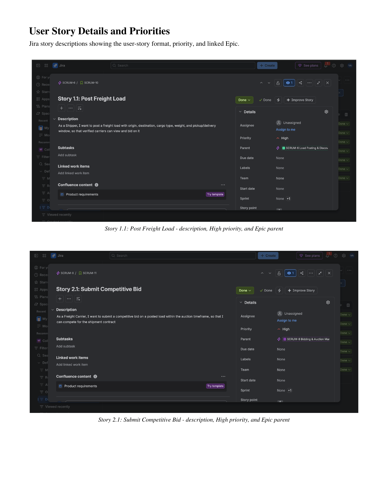
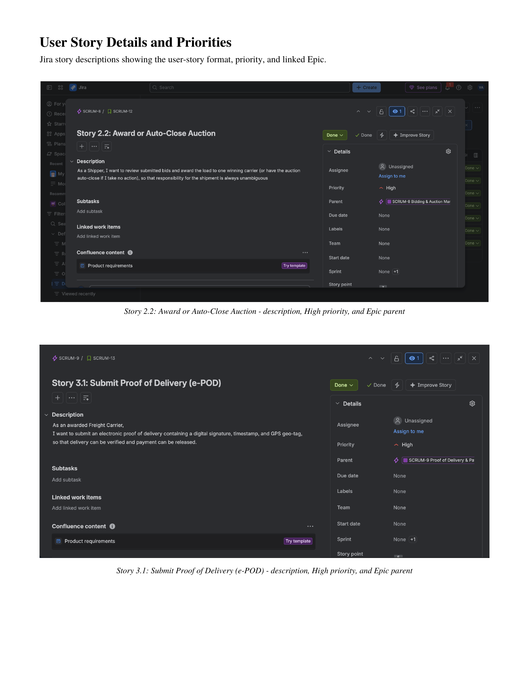

# Lab 2: Agile Backlog Creation & Sprint Simulation in Jira

**Problem Statement #28 — Inter-City Freight Load Matching Marketplace**

This submission is shown below page by page for direct viewing on GitHub.

## Page 1

## Page 2

## Page 3

## Page 4

## Page 5

## Page 6

## Page 7

## Page 8

## Page 9

